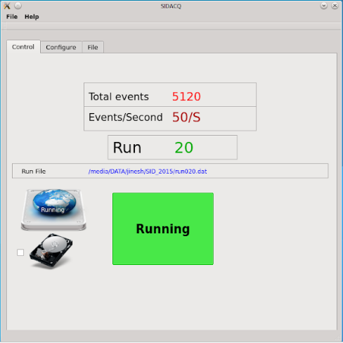
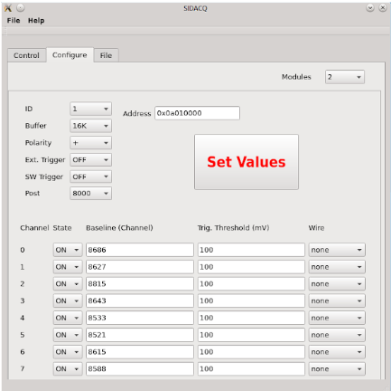

# SIDACQ: MWPC Data Acquisition Software

SIDACQ is a Qt-based data acquisition (DAQ) application designed to read, configure, and store data from Multi-Wire Proportional Chambers (MWPCs). It specifically interfaces with CAEN V1724 digitizers to handle the analog-to-digital conversion of signals from the chamber's 95 wire outputs (distributed across 5 wire planes, each with 19 wires).

The system provides a graphical user interface for complete control over the DAQ process, from hardware initialization to real-time data storage in a MySQL database.




## System Architecture

The data flows from the physical detector through the hardware and software components in the following sequence:

1.  **MWPC Detector**: The 5-plane, 95-wire proportional chamber detects particle events.
2.  **Preamplifiers**: Amplify the weak signals from the detector wires.
3.  **CAEN V1724 Digitizers**: Receive the amplified analog signals and digitize them. They are connected to the host computer via USB.
4.  **SIDACQ Application**:
    * **GUI (MainWindow)**: The user configures all hardware and software parameters, starts/stops the run, and monitors the event rate.
    * **Hardware Interface (`caen1724`)**: This layer communicates directly with the CAEN V1724 digitizers using the official CAEN library. It handles setting trigger thresholds, DC offsets, record lengths, and fetching data buffers.
    * **Data Server (`dataServer`)**: Acts as a middle layer that receives raw data buffers from the hardware interface. It queues the data for database insertion.
    * **MySQL Updater (`updatemysql`)**: A dedicated thread that pulls data from the queue and writes it into a MySQL database for permanent storage.

## Key Features

* **Graphical User Interface**: An intuitive Qt-based interface for easy configuration and run control.
* **Multi-Module Support**: Capable of initializing and managing multiple CAEN V1724 digitizer modules.
* **Comprehensive Hardware Configuration**:
    * **Per-Channel**: Enable/disable, DC offset, trigger threshold, and custom wire mapping.
    * **Global**: Record length, post-trigger percentage, external/software trigger modes, and polarity.
* **Persistent Configuration**: All settings can be saved to and loaded from a human-readable `.cfg` file.
* **Real-time Data Storage**: Event data is processed and stored in a MySQL database for robust, queryable access.
* **Baseline Calibration**: Automatically calculates and displays the baseline for each active channel before starting a run.
* **Live Run Monitoring**: The GUI displays the total event count, event rate per second, current run number, and output file name.
* **Optional Raw Data Logging**: Ability to save the raw, unprocessed data buffers to binary `.dat` files for offline analysis or debugging.

## Requirements

### Hardware

* A Multi-Wire Proportional Chamber (designed for 5 planes of 19 wires each).
* Preamplifier electronics for the 95 wire channels.
* One or more **CAEN V1724** digitizers.
* A USB cable to connect the digitizer to the host PC.
* A PC capable of running the required software.

### Software Dependencies

* **Qt 5 Framework**: (Core, GUI, SQL, and Network modules are essential).
* **CAEN Digitizer Library**: The official drivers and libraries for the V1724 model must be installed.
* **MySQL Server**: A running instance of MySQL is required for data storage.
* **MySQL C++ Connector**: The `QMYSQL` driver for Qt must be available.
* A C++ compiler that supports C++11 (e.g., GCC).

## Installation and Compilation

1.  **Install Dependencies**:
    * Install the Qt 5 development environment.
    * Install the CAEN Digitizer libraries, ensuring they are accessible in your system's library path.
    * Install MySQL server and the development libraries.

2.  **Clone the Repository**:
    ```bash
    git clone <repository-url>
    cd <repository-directory>
    ```

3.  **Compile the Application**:
    * Open the project `.pro` file in Qt Creator.
    * Configure the project to locate the CAEN and MySQL libraries if they are in non-standard locations.
    * Build the project using the Qt Creator IDE or from the command line:
        ```bash
        qmake
        make
        ```

## Database Setup

The application requires a specific database and table structure to function. The connection credentials are hardcoded in `updatemysql.cpp` (it is strongly recommended to change these for production use).

**Default Credentials:**
* **Host**: `localhost`
* **User**: `root`
* **Password**: `*let*it*go*`

Execute the following SQL commands to prepare the database:

```sql
-- Create the database
CREATE DATABASE siddata;

-- Use the new database
USE siddata;

-- Create the table for raw data
CREATE TABLE rawdata (
    id INT PRIMARY KEY NOT-NULL,
    boardID BLOB,
    data LONGBLOB,
    flag INT
);

-- Populate the table with rows for the buffer ring
INSERT INTO rawdata (id, flag) VALUES (1, 0), (2, 0), (3, 0), (4, 0), (5, 0), (6, 0), (7, 0), (8, 0), (9, 0), (10, 0);

-- Set the flag to 0 to indicate all rows are ready for writing
UPDATE rawdata SET flag=0; 
```

##  Configuration
he application uses a .cfg file to manage all settings. You can create this file manually or save it from the GUI via File -> Save Config. Below is a complete example for a single module.
```
NumberOfModules    1
    ID  1
        Address  0x0a040000
        ReccordLength   16K
        Polarity    +
        ExtTrigger  OFF
        SWTrigger   ON
        PostTrigger 4000
            channel 0
                ChannelState    ON
                ChannelBaseline    3456
                ChannelTrigThreshold    50
                WireMap 1
            channel 1
                ChannelState    ON
                ChannelBaseline    3452
                ChannelTrigThreshold    50
                WireMap 2
            channel 2
                ChannelState    ON
                ChannelBaseline    3458
                ChannelTrigThreshold    50
                WireMap 3
            channel 3
                ChannelState    ON
                ChannelBaseline    3451
                ChannelTrigThreshold    50
                WireMap 4
            channel 4
                ChannelState    ON
                ChannelBaseline    3455
                ChannelTrigThreshold    50
                WireMap 5
            channel 5
                ChannelState    ON
                ChannelBaseline    3459
                ChannelTrigThreshold    50
                WireMap 6
            channel 6
                ChannelState    ON
                ChannelBaseline    3453
                ChannelTrigThreshold    50
                WireMap 7
            channel 7
                ChannelState    ON
                ChannelBaseline    3457
                ChannelTrigThreshold    50
                WireMap 8
File     /media/DATA/
```
## Configuration Parameters
- NumberOfModules: The total number of digitizer modules to initialize.
- ID: The logical ID for the module (1-12).
- Address: The VME/USB address of the digitizer module.
- ReccordLength: The number of samples per event (e.g., 16K, 32K).
- Polarity: Pulse polarity (+ or -).
- ExtTrigger/SWTrigger: ON or OFF.
- PostTrigger: Number of post-trigger samples.
- channel: Section for each of the 8 channels in a module.
  -  ChannelState: ON or OFF.
  - ChannelBaseline: The calculated DC baseline (can be set manually or updated by the program).
  - ChannelTrigThreshold: The trigger threshold value.
  - WireMap: An integer mapping the hardware channel to a logical wire. The integer corresponds to the index in the GUI's dropdown list (e.g., 1 = WP1Wire1, 20 = WP2Wire1, etc.).
- File: The directory where optional raw .dat run files will be saved.
## Usage
1. Launch the application.
2. Load Configuration: Go to File -> Open Config to load your .cfg file, or configure all parameters manually using the GUI.
3. Set Output Directory: Click the [...] button to select a directory for saving raw data files.
4. Enable Data Saving (Optional): Check the "Save Raw Data File" box if you want to log raw data buffers to .dat files.
5. Start Acquisition: Click the "Stopped" button.
   - The application will initialize all configured digitizers.
   - It will perform a baseline calculation run and update the baseline values in the GUI.
   - The main acquisition will begin, and the button will turn green and read "Running".
   - Event counters will update in real-time.
6. Stop Acquisition: Click the "Running" button to stop the run. The button will turn red and read "Stopped".
## License
This program is free software; you can redistribute it and/or modify it under the terms of the GNU General Public License as published by the Free Software Foundation. This is in accordance with the license specified in the included CAEN library headers. This program is distributed in the hope that it will be useful, but WITHOUT ANY WARRANTY.

## Contact
For questions or issues, please contact jinesh.kallunkathariyil@gmail.com.